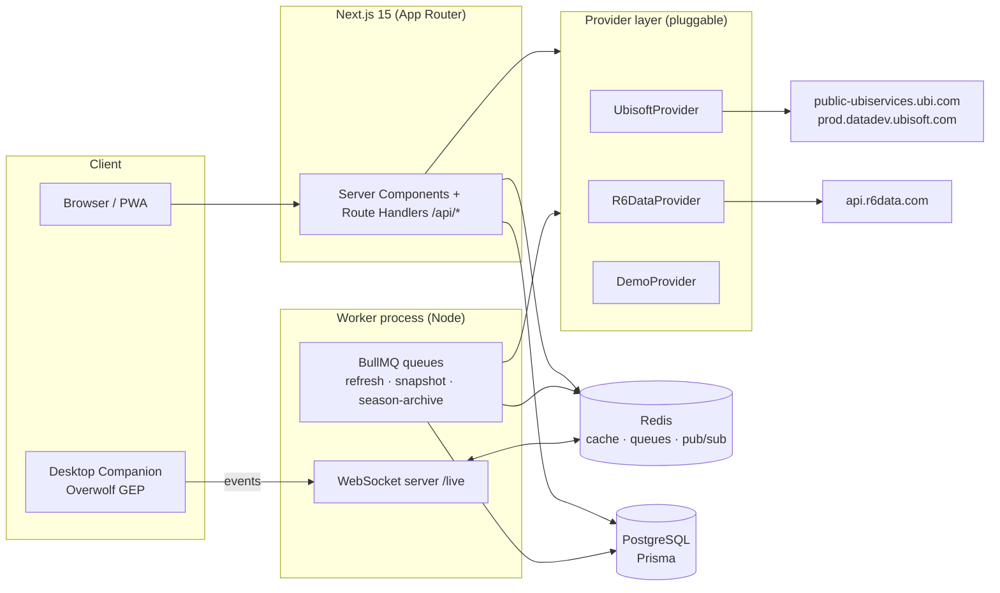

# SiegeIQ — System Architecture

Companion doc to [RESEARCH.md](./RESEARCH.md) (data-source ground truth) and [ROADMAP.md](./ROADMAP.md) (phasing).

## 1. Goals and non-goals

Goals: a commercial-grade Siege companion where a visitor types a username + platform and gets rank, seasonal boards, operator/map/weapon breakdowns, self-recorded rank history and inferred match history, evidence-based insights, and — with the optional desktop companion — live match scouting and coaching. End users never authenticate, never paste tokens, never create API keys.

Non-goals: reading game memory outside Overwolf; fabricating data Ubisoft doesn't provide (pre-tracking season history, hidden MMR, enemy rosters without a companion in the lobby); scraping tracker sites.

## 2. Topology



One repo, two processes: the Next.js app (UI + REST) and a worker (queues + WebSocket ingest). Both share `src/lib`. Deployment A (recommended first): single VPS via docker-compose (app, worker, Postgres, Redis, Caddy/Cloudflare in front). Deployment B: Vercel for the app + Neon Postgres + Upstash Redis + the worker on Fly.io/Railway — required because Vercel functions can't hold WebSockets or long-lived queue consumers.

## 3. Stack

Next.js 15 (App Router, RSC, streaming, ISR) · TypeScript strict · Tailwind CSS 4 · Framer Motion · Recharts · Prisma + PostgreSQL · Redis (ioredis) for cache/queues/pub-sub · BullMQ workers · `ws` for the live socket · Zod at every external boundary · Vitest + ESLint + Prettier · Docker · GitHub Actions.

## 4. Provider abstraction

No call site in the app touches an external API directly. `src/lib/providers/types.ts` defines the contracts; adapters implement them; a registry does priority + failover + health.

```ts
interface IdentityProvider   { searchByUsername(platform, name): Promise<PlayerIdentity[]> }
interface IRankProvider      { getBoards(profileId, family): Promise<SeasonBoards> }
interface IPlayerStatsProvider { getSummary(q): Promise<SummaryStats>; getOperators(q): Promise<OperatorStat[]>;
                                 getWeapons(q): Promise<WeaponStat[]>; getMaps(q): Promise<MapStat[]> }
interface ILiveMatchProvider { getLiveState(profileId): Promise<LiveMatchState | null> }
interface IServiceStatusProvider { getStatus(): Promise<PlatformStatus[]> }
```

Adapters: **UbisoftProvider** (direct, primary), **R6DataProvider** (API-key fallback), **DemoProvider** (deterministic seeded data; always healthy; default when no credentials — the app runs out of the box). `PROVIDER_ORDER=ubisoft,r6data,demo` in env picks the chain; the registry tries providers in order, records failures, opens a circuit for a cooling-off period after N consecutive errors, and reports health to `/api/health` and the admin panel. Every adapter gets: retry with exponential backoff + jitter (429/5xx only), a token-bucket rate limiter (per-provider budget), timeout, and structured logging.

**Ubisoft session manager.** One service account (env: `UBI_EMAIL`, `UBI_PASSWORD` — a dedicated burner, 2FA off). Ticket cached in Redis with its expiry (~3 h) and refreshed on 401, guarded by a Redis lock so concurrent requests trigger exactly one login (Ubisoft 429s aggressive logins). Two `Ubi-AppId` values in constants (old-gen + new-gen) since some endpoints care.

## 5. Caching (Redis, read-through)

| Data | TTL | Why |
|---|---|---|
| username → profileId | 24 h (+ permanent copy in Postgres) | Names change rarely; aliases kept as history |
| ranked boards (`full_profiles`) | 3 min | Drives "refresh profile"; short enough to feel live |
| datadev seasonal stats | 15 min | Expensive; changes only after matches |
| static data (operators/maps/weapons) | in-repo JSON, no fetch | Ships with build |
| service status | 60 s | Cheap public endpoint |
| news | 30 min | CMS |
| leaderboard pages | 5 min | Computed from own DB |

Stale-while-revalidate: serve cached value instantly, enqueue background refresh if older than half its TTL. Per-IP rate limits on public API routes (sliding window in Redis). HTTP layer: ISR for operator/map/weapon database pages (revalidate daily), streaming RSC + skeletons for profile pages.

## 6. Persistence model (Prisma)

`Player` (profileId PK, userId, platform, currentName, aliases[], avatarUrl, firstSeenAt, lastRefreshedAt, optOut) · `ProfileSnapshot` (player, takenAt, board, seasonId, rankId, rankPoints, maxRankPoints, kills, deaths, wins, losses, abandons — the raw material for history) · `InferredMatch` (player, playedAt, board, rpDelta, outcome W/L/A, confidence; unique on player+takenAt) · `SeasonArchive` (player, seasonId, board, final numbers; written by the pre-rollover job and on last snapshot of a season) · `OperatorSeasonStat` / `MapSeasonStat` / `WeaponSeasonStat` (per player+season+side aggregates from datadev, upserted on refresh) · `LiveSession` + `LiveMatchEvent` (companion telemetry) · `TrackedPlayer` (refresh priority, requested-by count).

**Match inference:** when two consecutive snapshots differ, wins+losses+abandons deltas emit that many `InferredMatch` rows (RP delta apportioned; single-match deltas get exact RP and `confidence=high`, multi-match gaps get averaged RP and `confidence=low` — the UI labels these "session" rows, exactly the honest framing R6 Tracker uses for web-only players). Snapshot cadence: on every profile view (min 3-min gap), plus queue-driven refresh for `TrackedPlayer`s (frequent players hourly, dormant daily), plus a season-rollover sweep that archives every known player in the final 48 h of a season.

## 7. Live match pipeline

Companion (Overwolf app, `companion/`) subscribes to GEP features (`me`, `match_info`, `roster`, `kill`, `death`, round/phase) and forwards normalized events over `wss://…/live/ingest?token=<pairing token>`. Pairing: the user clicks "Connect companion" on their profile page → server issues a short-lived pairing code → companion stores a per-install token. The worker validates, writes `LiveMatchEvent`s, publishes to Redis pub/sub channel `live:<profileId>`; the live page subscribes over WS (`/live/subscribe`) and renders roster, per-player stats (each roster name is resolved through the normal provider pipeline — same code path as profile search), streak/abandon context, and coach output. If no companion is connected the page says so plainly and links setup instructions. Win-probability estimate: logistic blend of team average RP, recent W/L form, and map-side win rates — computed only from fields we actually have, shown with an explicit confidence band.

## 8. AI Coach — evidence-gated rules engine

No generative model invents facts. `src/lib/insights` computes typed `Insight { id, text, severity, confidence, evidence }` from recorded aggregates only, and every rule declares minimum sample sizes (e.g. map win-rate advice requires ≥15 rounds on that map; operator advice ≥20 rounds on the operator; "no hard breach on attack" requires a full known roster). Insight templates are parameterized sentences ("Your best operator on Clubhouse is {op} ({wr}% over {rounds} rounds)"), so output can never claim something the evidence object doesn't contain. Live coach = same engine fed with live roster + static counter/synergy tables (e.g. Mira/Azami → recommend Flores/Kali/Maverick) — the static tables are data, versioned in-repo, reviewed each patch. An optional LLM pass may *rephrase* insight text later (roadmap), but severity/claims/values come from the engine; the LLM never adds facts.

## 9. API surface (route handlers)

`GET /api/players/search?platform&name` · `GET /api/players/:profileId/summary|boards|operators|weapons|maps|seasons|matches` · `POST /api/players/:profileId/refresh` (rate-limited) · `GET /api/status` (Siege servers) · `GET /api/health` (providers, Redis, DB) · `GET /api/live/:profileId` (current live state) · `/api/admin/*` (bearer `ADMIN_TOKEN`): provider health, cache stats, queue depth, feature flags, maintenance mode. All responses zod-validated, versioned envelope `{ data, meta: { source, fetchedAt, stale } }` so the UI can badge data provenance.

## 10. Frontend system

Design language: near-black `#0B0D12` base, glass cards (`bg-white/[0.04]`, `border-white/[0.08]`, `backdrop-blur`), one signal-orange accent gradient reserved for primary actions and rank-up moments, cyan/violet only in charts; Inter/Geist type; 12-column responsive grid; Framer Motion for page transitions, staggered card reveals, and number tickers; skeletons for every async region; zero layout shift (fixed-size stat tiles). Pages: Home (hero + search + live service status + meta highlights), Profile (rank header, stat tiles, rank graph, operator/weapon/map tabs, match timeline, insights panel), Operators DB (+detail), Weapons DB, Maps DB (+detail), Live, Compare (roadmap), Admin. Accessibility: focus-visible rings, reduced-motion variant, semantic landmarks, AA contrast. SEO: per-player OG images (roadmap), metadata API, sitemap for database pages. PWA manifest + installability.

## 11. Security & privacy

Service credentials only in server env (never `NEXT_PUBLIC_*`); companion tokens are per-install, revocable, scoped to one profileId; per-IP and per-route rate limits; strict CSP; no user accounts in v1 (nothing sensitive stored); player opt-out honored by hard-deleting rows and blocking re-index; Ubisoft trademark disclaimer in footer; robots.txt allows database pages, disallows admin.

## 12. Failure honesty

Every data panel renders one of: fresh data (with source badge), stale data (amber "cached 14 min ago"), or an explicit error state ("Ubisoft's stats service is not responding — showing last snapshot from …"). The UI never silently substitutes demo data outside demo mode; demo mode shows a persistent banner.

---

> **NOTE (2026-07-07):** This document predates the monorepo restructure.
> The system it describes now lives in `packages/` and `apps/` (see the root
> README for the current layout). Section §8 (evidence gating) and §9 (API
> envelope) still apply verbatim; window/process topology is superseded by
> `apps/desktop` (Overwolf app) + `apps/api` (Fastify service).
